# Charla R Madrid
27-03-2025

_Reunión Grupo de R: Jueves 27 de marzo de 2025_

En este tutorial veremos cuatro formas relativamente sencillas, y ordenadas de menor a mayor dificultad, para crear nuestros propios espacios en Internet para poder compartir nuestras creaciones, aprendizajes y quienes somos usando R, y de forma completamente gratuita. En una tarde podrías tener tu propio sitio web para presentarte, o para subir las cosas que has aprendido, o para destacar tu trabajo!

Los contenidos son:

1. Crear repositorios en github
2. Crear páginas estáticas con documentos Quarto y GitHub Pages
3. Crear sitios web con Quarto
4. Crear blogs con Quarto
5. Crear blogs con Hugo Apéro

<div style = "max-width: 350px;">

</div>

Para más información, tutoriales y contacto, [visita mi sitio web.](https://bastianolea.rbind.io)

----


## GitHub
### Conectar R a GitHub
- [Tutorial más detallado sobre esto escrito por mi](https://bastianolea.rbind.io/blog/r_introduccion/tutorial_github/)
- Libro tutorial para aprender a usar git con R: [https://happygitwithr.com](https://happygitwithr.com)

```r
install.packages("usethis")
```

1. Configurar nombre de usuario y correo
```r
usethis::use_git_config(user.name = "Basti", user.email = "baolea@uc.cl")
```

2. Crear un _token_ en GitHub para permitir el acceso de R a tu cuenta.
```r
usethis::create_github_token()
```
Se abrirá una ventana de GitHub en la que podrás generar y copiar el _token_.

3. Ejecutar la siguiente función, y pegar el _token_ que copiaste:
```r
gitcreds::gitcreds_set()
```

4. Confirmar que está funcionando bien:
```r
usethis::git_sitrep()
```


### Crear un repositorio local

```r
usethis::use_git()
```
Preguntará si quieres hacer _commit_ de tus archivos. _Commit_ significa agregar los archivos modificados a la versión del proyecto que guardaremos/respaldaremos.

### Subir el repositorio local a GitHub

```r
use_github()
```
Se creará un repositorio remoto en tu cuenta de GitHub con el mismo nombre que el proyecto, y se abrirá una ventana de tu navegador con el repositorio subido. 


### Crear un archivo `readme.md`
Si tu proyecto/repositorio tiene este archivo, aparecerá en GitHub como descripción del código (como la que estás leyendo ahora!)
```r
use_readme()
```


---- 


## Documentos Quarto 

Los [documentos Quarto](https://quarto.org/docs/get-started/hello/rstudio.html) combinan la escritura normal con el código. La escritura, como los párrafos, títulos, y subtítulos se escriben usando la sintaxis [markdown](https://quarto.org/docs/authoring/markdown-basics.html), un lenguaje de marcado que nos permite traducir textos en html usando sencillos símbolos.

Para crear un documento Quarto, en el menú _File_ elige _New File_ y luego _Quarto Document_.

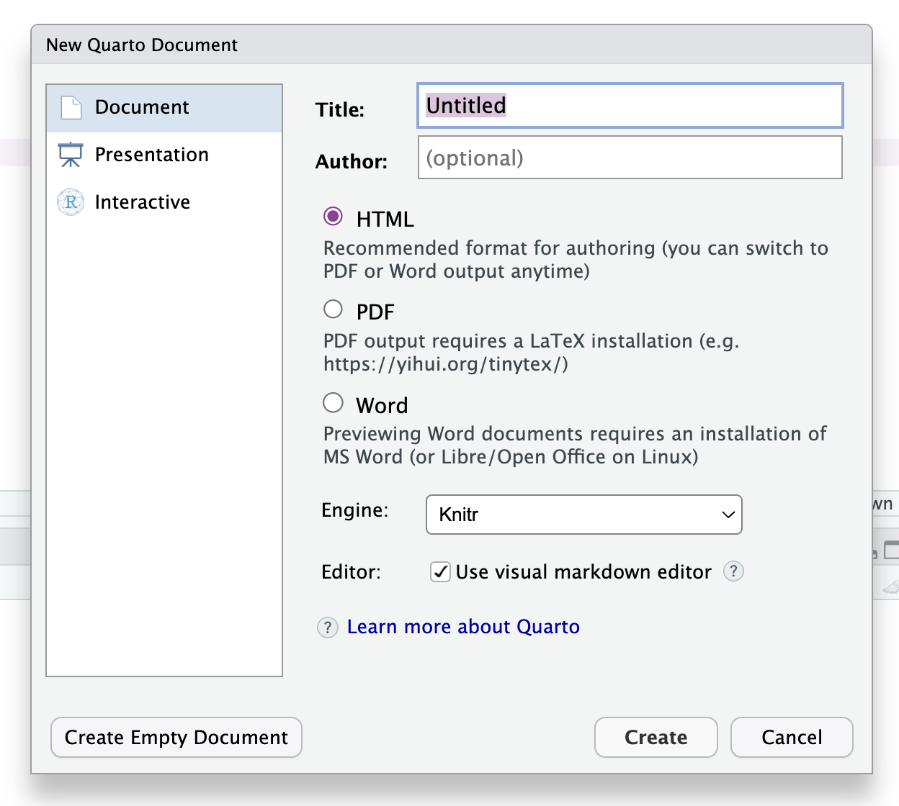

Se abrirá un documento de ejemplo que puedes usar como base para tus propios documentos. En este caso, agregamos un _chunk_ con un gráfico sencillo, y presionamos el botón **Render** para generar el documento en `html`:

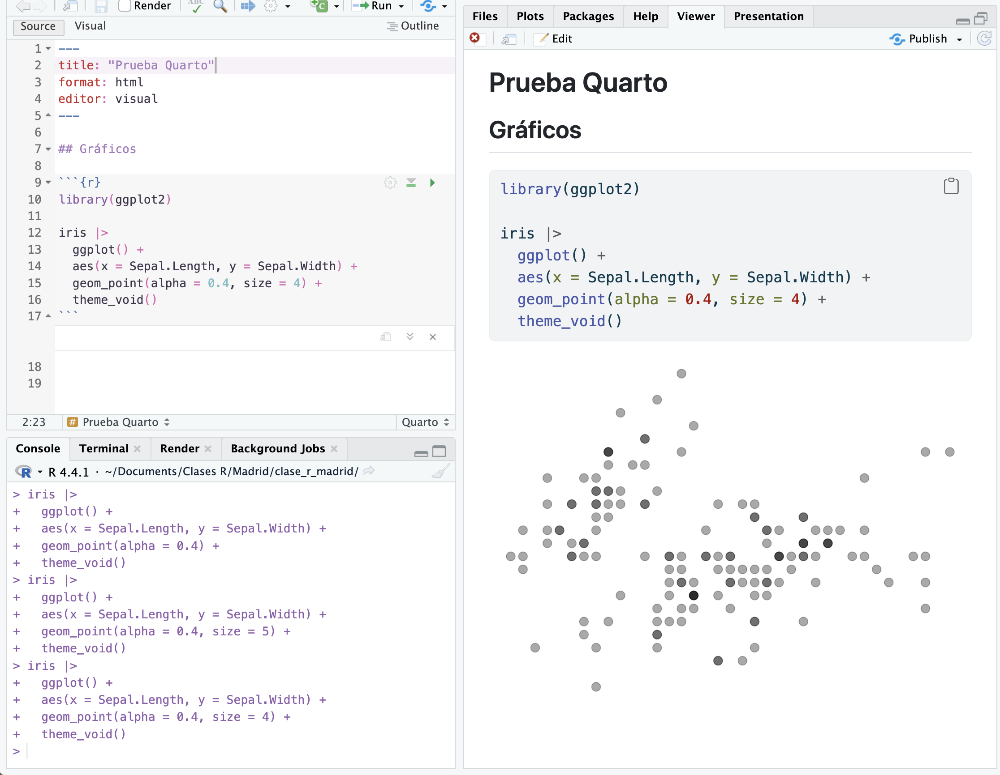

Como vemos, obtenemos tres archivos en nuestro proyecto: el archivo `.qmd` que contiene el código que genera el documento, el documento _renderizado_ en formato `html`, y una carpeta que contiene recursos necesarios para visualizar el documento:
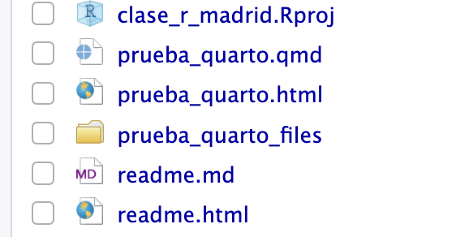

El problema es que esta carpeta, que contiene cosas como imágenes (de los gráficos), estilos y scripts, dificultan la portabilidad del documento y la posibilidad de compartirlo con otros.

La buena noticia es que podemos generar un reporte Quarto **autocontenido**; es decir, que no se requieran archivos externos al documento `html`. Agregamos el siguiente código al _header_ del documento Quarto, en reemplazo del `format: html`:

```yaml
format: 
  html:
    embed-resources: true
```
Hay que tener cuidado de que se respeten los espacios en blanco para que funcione bien. Si eliminas el reporte en `html` y la carpta `_files` y le das _render_ nuevamente al documento Quarto, verás que ahora se genera solamente el reporte en `html`, listo para poder ser compartido!

----


## Documento Quarto en GitHub Pages

Quizás no queremos enviar el documento Quarto que creamos, sino que queremos hacer que esté disponible para que otras personas puedan verlo en línea. Para esto, podemos usar [GitHub Pages](https://pages.github.com) para hacer que nuestro documento Quarto se transforme en una página de internet que otras personas pueden visitar tan sólo con entrar al enlace.

Para hacer esto, necesitamos configurar primero el documento Quarto, subir nuestro documento Quarto a un repositorio de GitHub, y configurar el repositorio para que genere una página web estática a partir del documento. Todas estas instrucciones están detalladas [en esta guía oficial](https://quarto.org/docs/publishing/github-pages.html), pero a continuación te resumo lo principal.

La configuración del documento Quarto consiste revisar el nombre del archivo, y en agregar un archivo de configuración a nuestro proyecto que hará que se guarden los archivos necesarios en una sola carpeta.

Esto es importante, porque así GitHub Pages sabrá que éste es el documento específico que queremos que sea nuestra página web.

Revisemos el *nombre del documento Quarto**. Para que nuestro documento Quarto se publique como una página GitHub Pages, debe llamarse `index.qmd` (para que se genere un documento `index.html`), o bien, puede llamarse como queramos, pero agregando el siguiente código al header `yaml` del documento Quarto:

```yaml
format: 
  html:
    output-file: "index"
```
De este modo, el documento `html` resultante de nuestro documento Quarto se llamará `index.html`. 

El siguiente paso de configuración implica agregar un **archivo de configuración** al proyecto. En el panel de archivos (_File_) de RStudio, presionamos el botón _New File_ y creamos un archivo de texto en blanco, llamado `_quarto.yml`:

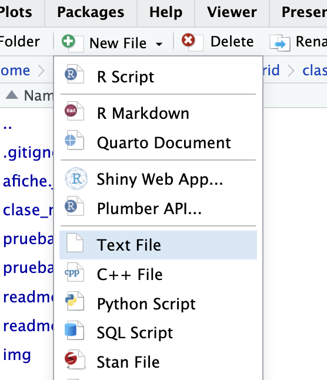

En `_quarto.yml`, pegamos el siguiente código de configuración:

```yaml
project:
  output-dir: docs
```

Con esta configuración le estamos pidiendo Quarto que guarde los recursos que necesita dentro de una carpeta `docs`, que es lo que necesitamos para generar nuestra página web.

Si le damos _render_ al documento Quarto, se generará la carpeta `docs` con los recursos necesarios dentro. 

Otra configuración que debemos crear para GitHub Pages se hace mediante la creación de un archivo vacío. En el proyecto desde RStudio creamos un nuevo archivo que se llame `.nojekyll`, y que esté vacío. Este archivo es para decirle a GitHub Pages que no procese el sitio con Jekyll, porque del sitio nos encargamos nosotres.

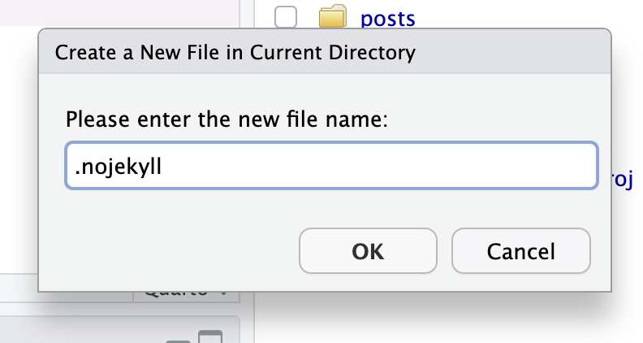

Ahora tenemos que subir estos cambios al repositorio remoto GitHub. En la pestaña _Terminal_ de RStudio (al lado de la consola) ejecutamos los tres siguientes comandos:

```bash
git add .
git commit -m "documento quarto en docs"
git push
```

Con el primer comando le pedimos que todos los archivos nuevos sean considerados para el _commit_, con el segundo creamos el _commit_ y le damos un mensaje, y con el tercero hacemos _push_ para subir los cambios al repositorio remoto.

Si vamos a GitHub debiesen estar nuestros nuevos archivos arriba. Ahora vamos a configurar GitHub para que genere una página web a partir del documento Quarto. Vamos a la seccion _Settings_:


Dentro de _Settings_, en el menú izquierdo vamos a _Pages_. Dentro de _Pages_, tenemos que seleccionar la rama del repositorio que queremos usar (usualmente _main_ o _master_), y especificar que queremos apuntar a la carpeta `/docs`. Luego presionamos _Save_.


Se tomará unos segundos o minutos en generar la página web, pero luego aparecerá el siguiente mensaje que te permitirá acceder al sitio:

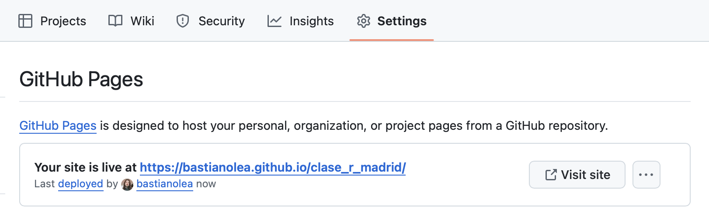

¡Listo! Ahora puedes compartir tu página con todo el mundo. El enlace será algo como `https://usuario.github.io/repositorio/`

Ojo que con este método sólo podremos publicar un documento Quarto por repositorio.

Puedes ver las instrucciones completas para este proceso [en esta guía oficial.](https://quarto.org/docs/publishing/github-pages.html)


----


## Sitios web Quarto en GitHub Pages

Otra opción que tenemos para construir sitios más completos, pero también basados en documentos Quarto, donde podamos combinar texto y código, es [crear un sitio web Quarto.](https://quarto.org/docs/websites/)

Con esta modalidad de documentos Quarto podemos crear un sitio web con múltiples secciones, enlaces, página de presentación, y más, que te puede servir como un espacio en Internet para presentarte y que otras personas te encuentren, y puedan conocer tu trabajo y trayectoria.


### Crear el sitio web Quarto
Al crear un nuevo proyecto desde RStudio podemos elegir la opción _Quarto Website_:

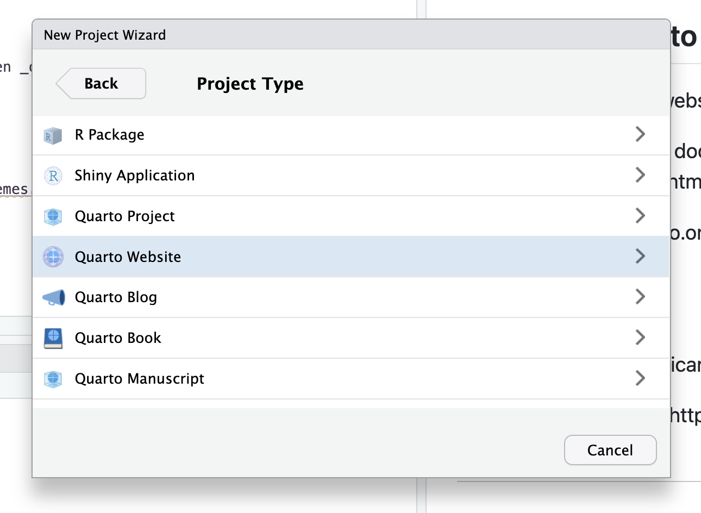

Se abrirán una nueva sesión de R y veremos que nuestro proyecto ya viene con varios archivos dentro. Primero que nada, presionemos _Render_ para previsualizar lo que tenemos como base:

 

El proyecto ya viene con un sitio web funcional, que podemos explorar. Viene con dos páginas por defecto, `index.qmd` y `about.qmd`. Ambas puedes modificarlas a tu gusto con el contenido que desees. 

Estas páginas aparecen en la barra de navegación (arriba del sitio web, o en el lado izquierdo si la pantalla/ventana es pequeña), para que tus usuarios puedan acceder a ellas.


### Agregar páginas a tu sitio

Para agregar nuevas páginas al sitio, simplemente creamos nuevos documentos Quarto normalmente (_New File_, _Quarto Document_). Para hacer que sean agregados a la barra de navegación, entra al archivo de configuración de tu sitio, `_quarto.yml`. En este archivo, verás la configuración general de tu sitio:

```yaml
website:
  title: "tutorial_sitio_web_quarto"
  navbar:
    left:
      - href: index.qmd
        text: Home
      - about.qmd
```

Esa es la lista de páginas de tu sitio web. Al igual como sale hecho con la página `about.qmd`, si agregas ahí el nombre de un documento Quarto nuevo, será agregado a la barra de navegación. 

Estas páginas también pueden ser enlaces a cualquier otro sitio web. Por ejemplo, si quieres agregar un enlace a tu GitHub o a alguna red social, haz lo siguiente:

```yaml
website:
  title: "tutorial_sitio_web_quarto"
  navbar:
    left:
      - href: index.qmd
        text: Home
      - about.qmd
      - icon: github
        href: https://github.com/bastianolea
      - icon: linkedin
        href: https://www.linkedin.com/in/bastianolea/
```

Los enlaces aparecerán con los logos de las redes sociales que definas! Sólo recuerda que los enlaces tienen que empezar con `https://`.


### Cambiar temas
Dentro del mismo documento `_quarto.yml` puedes cambiar el tema de tu sitio web, para darle un toque más personalizado. Puedes [elegir entre 25 temas, que puedes conocer en esta guía.](https://quarto.org/docs/output-formats/html-themes.html#overview)

```yaml
format:
  html:
    theme: lux
    css: styles.css
    toc: true
```

La página `about.qmd` [también puede personalizarse](https://quarto.org/docs/websites/website-about.html#templates).


### Publicar el sitio en GitHub Pages

Para publicar el sitio en GitHub Pages tenemos que seguir las mismas [instrucciones para publicar en GitHub Pages](https://quarto.org/docs/publishing/github-pages.html) que seguimos en el paso anterior:

Primero, en el archivo de configuración `_quarto.yml` agregamos `output-dir: docs` debajo de `project:` y hacemos _Render_ al documento `index.qmd`.

También podemos ejecutar `quarto render` desde la pestaña de Terminal para reconstruir el sitio completo.

En el proyecto desde RStudio, creamos un nuevo archivo vacío que se llame `.nojekyll`, para decirle a GitHub Pages que no procese el sitio con Jekyll. Si no haces esto, cuando entres a un post del blog te aparecerá un error 404! 😨

Luego debemos hacer que nuestro proyecto sea un repositorio git (`usethis::use_git()`) y subir el repositorio a GitHub (`usethis::use_github()`), o si ya era un repositorio git y ya estaba en GitHub, hacer `git add.`, `git commit -m "actualizacion"`, y `git push` desde la pestaña Terminal.

Una vez que subimos nuestros cambios al repositorio remoto, vamos al repositorio en GitHub, _Settings_, _Pages_, y configuramos el repositorio para que genere la página desde `/docs`:


Siguiendo estas instrucciones ya tendrás tu sitio web básico listo! ¡Y gratis! 🥳 Ahora sólo falta hacerlo crecer agregando páginas, enlaces, y toda la información que quieras.

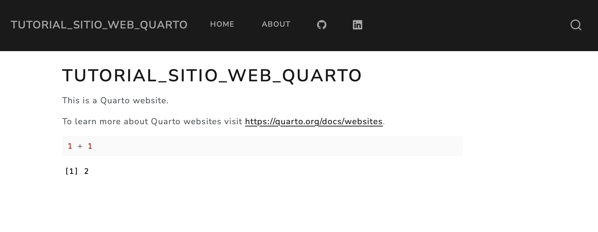


----


## Blog Quarto
Una tercera opción para presentarte al mundo por internet usando Quarto es [crear un blog Quarto.](https://quarto.org/docs/websites/website-blog.html)

Un blog funciona casi igual que un sitio web Quarto, con la diferencia de que el contenido está centrado en múltiples documentos Quarto que poseen más metadatos que le permiten agruparlos en categorías, en base a etiquetas, y ordenarlos por fechas. De este modo, tendrá un sitio web de presentación pero que además podrás ir subiéndole contenido periódicamente para ir compartiendo las cosas que haces. Recordemos que todo lo que hemos aprendido sobre R ácido gracias a personas que han querido compartir lo que saben, así que anímate a compartir lo que aprendes y lo que has creado!


### Crear un blog

Crear un nuevo proyecto desde RStudio, elegimos la opción _Quarto Blog_:


De la misma forma que cuando creamos el sitio web Quarto, el proyecto aparecerá con los archivos necesarios para tener un blog mínimo. Si presionamos _Render_ podremos provisionar nuestro blog:

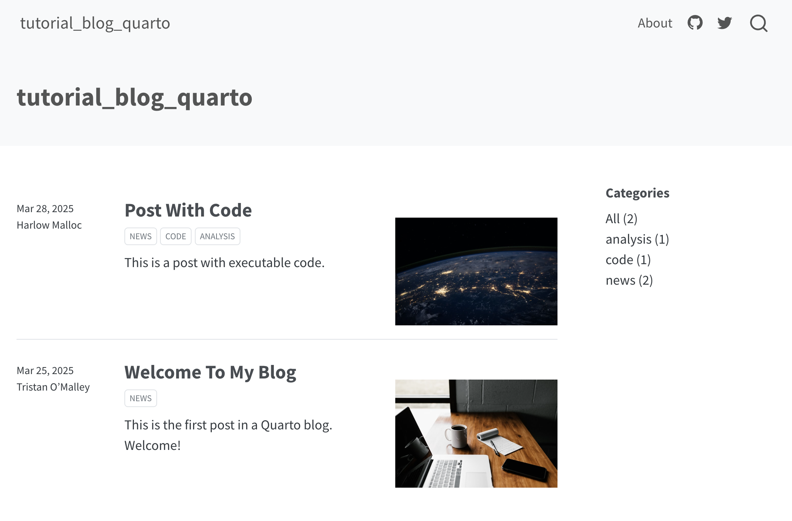


### Agregar posts al blog
El funcionamiento del blog es idéntico al del sitio web, con la distinción de que la idea es ir agregando publicaciones.

Dentro de la carpeta `posts` veremos que se encuentran las dos publicaciones de ejemplo que vienen con el proyecto. Si abrimos una de ellas, veremos que en su encabezado posee los metadatos que caracterizan a cada publicación:

```yaml
---
title: "Mi primera publicación en mi blog Quarto"
author: "Bastián Olea"
date: "2025-03-28"
categories: [noticias, R, programación]
image: "image.jpg"
---
```
Entonces, para crear una nueva publicación, creamos una carpeta dentro de `posts` (el nombre de la carpeta será la dirección de la publicación), y dentro de la carpeta creamos un documento Quarto llamado `index.qmd` con un encabezado que contenga título, autor, fecha, y etiquetas. 

Si presionamos _Render_ para generar el post, veremos que en el panel _Viewer_ de RStudio se previsualiza nuestro blog!

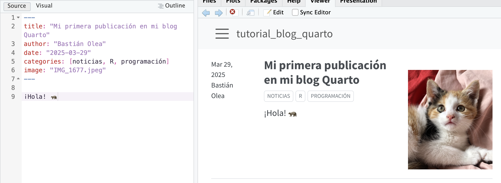


### Subir el blog Quarto a GitHub Pages

Nuevamente, las instrucciones para hacer que nuestro blog aparezca GitHub Pages son las mismas:

1. En `_quarto.yml` agregamos `output-dir: docs` debajo de `project:`.
2. En el proyecto, creamos un nuevo archivo que se llame `.nojekyll`, vacío (para decirle a GitHub Pages que no procese el sitio con Jekyll)
3. En la pestaña de terminal ejecutamos `quarto render` para construir el sitio completo.
3. Creamos un repositorio git (`usethis::use_git()`) 
4. Subimos el repositorio a GitHub (`usethis::use_github()`)
4. En GitHub, entramos a _Settings_, luego a _Pages_, y configuramos el repositorio para que genere la página desde `/docs`


Siguiendo estas instrucciones ya tendrás tu sitio web básico listo! ¡Y gratis! 🥳 Ahora sólo falta hacerlo crecer agregando páginas, enlaces, y toda la información que quieras.


Instrucciones para subir a GitHub
https://quarto.org/docs/publishing/github-pages.html#render-to-docs
_quarto.yml con output-dir: docs para github
touch .nojekyll

Instrucciones para Netlify
https://beamilz.com/posts/2022-06-05-creating-a-blog-with-quarto/en/#deploy-with-netlify
entrar
new site, elegir repo, poner _site, y listo


----


## Blog Hugo
Un blog Hugo es otra forma de crear un blog desde R, que también utiliza documentos Quarto, pero cuyo sistema de construcción es distinto. Al ser [creados con Hugo,](https://gohugo.io) resultan sitios mucho más personalizables, pero por lo mismo también pueden ser más complejos de mantener.

Como ejemplo, [mi propio sitio web](https://bastianolea.rbind.io) lo creé con Hugo, y [detallé parte del proceso en un post](https://bastianolea.rbind.io/blog/hugo_blog_nuevo/).

Las instrucciones de este proceso se escapan un poco al objetivo de esta guía, pero les dejo el siguiente enlace, que corresponde al [tutorial oficial para crear un blog Hugo con el tema Apéro,](https://hugo-apero-docs.netlify.app/) que detalla paso por paso todas las acciones que hay que hacer para construir un blog con Hugo, personalizarlo, y publicarlo usando Netlify.


Cabe mencionar que el tutorial mismo está construido en un blog Hugo Apéro.

En resumidas cuentas, las instrucciones son:
- Crear un nuevo proyecto de R
- `install.packages("blogdown")`
- `blogdown::install_hugo()`
- Y ejecutar lo siguiente para crear tu blog Hugo Apéro:

```r
library(blogdown)
new_site(theme = "hugo-apero/hugo-apero", 
           format = "toml",
           sample = FALSE,
           empty_dirs = TRUE)
```

Luego ejecutas `blogdown::serve_site()` para previsualizar el blog creado.

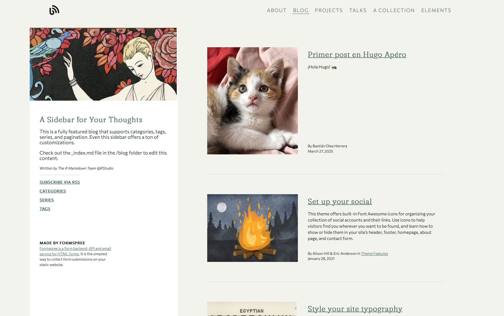

Para crear un post nuevo, tenemos una conveniente función que nos ayuda:
```r
# crear un post
blogdown::new_post(title = "Nubes aleatorias en ggplot", 
                   subdir = "blog/",
                   file = "blog/ggplot_nubes/index.md", # define el "slug", la dirección url del post
                   author = "Bastián Olea Herrera",
                   tags = c("ggplot2", "gráficos", "curiosidades"))
```


----


## Apps Shiny
Las aplicaciones Shiny son formas mucho más avanzadas y flexibles para poder compartir desarrollos en R con el mundo. Se trata de aplicaciones web completamente personalizables y que además son interactivas; significa que detrás de la aplicación web existe un proceso de R que está haciendo los cálculos para entregar resultados en tiempo real a sus usuarios.

Acá te dejo dos tutoriales para aprender a usar Shiny:

- [Tutorial Shiny](https://bastianolea.rbind.io/blog/r_introduccion/tutorial_shiny_1/)
- [Tutorial publicar en Shinyapps](https://bastianolea.rbind.io/blog/r_introduccion/tutorial_shinyapps/)

Y [comparto también un sitio mío](https://bastianolea.github.io/shiny_apps/) (creado con Quarto y alojado en GitHub Pages) para mostrar aplicaciones Shiny qeu he creado.

----

## Recursos:

- [Tutorial Git con R](https://happygitwithr.com)
- [Tutorial GitHub Pages](https://quarto.org/docs/publishing/github-pages.html)
- [Tutorial sitios web Quarto](https://quarto.org/docs/websites/)
- [Temas Quarto](https://quarto.org/docs/output-formats/html-themes.html#overview)
- [Tutorial Blog Quarto](https://beamilz.com/posts/2022-06-05-creating-a-blog-with-quarto/en/)
- [Tutorial Quarto y Netlifly](https://jadeyryan.com/blog/2024-02-19_beginner-quarto-netlify/)

Puedes encontrar más recursos sobre R [en mi sitio web!](https://bastianolea.rbind.io)